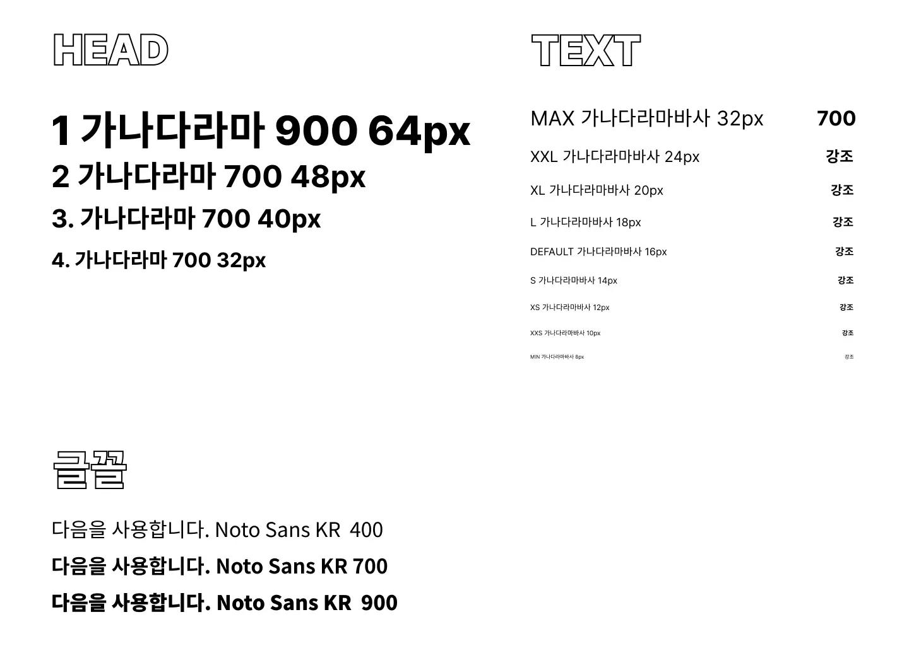

## 참고사항

아마 큰 프로젝트가 아니라서, 컴포넌트에 대한 디자인 시스템을 정의하지는 않을 거에요.
다만, 다음과 같이 폰트와 칼라의 경우 일관성을 위해 따로 설정을 해두었답니다. 😉

혹시, 이 정보가 부족하시다면 [Figma](https://www.figma.com/file/hl7Y6CCjVpxKSErbojMVWd/Untitled?node-id=0%3A1)를 참조해주세요.

